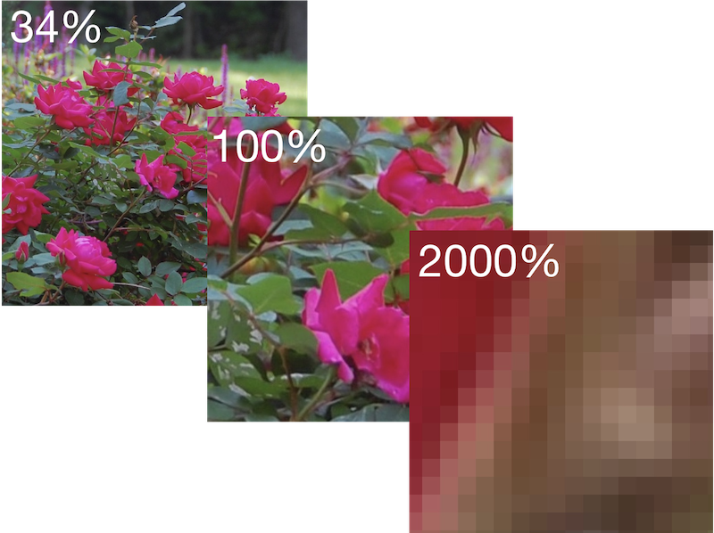

 

# Image Zoom-Level and Pan Utilities

This MATLAB project includes functions for setting and querying an image zoom level and pan location, as well a function for determining the physical extent of image pixels as currently displayed. The functions include:

- `zoomImage`
- `getImageZoomLevel`
- `setImageZoomLevel`
- `getAxesCenterXY`
- `setAxesCenterXY`
- `getImagePixelExtentInches`

## Installation

Download the `.mltbx` file from the [GitHub repository releases area](https://github.com/eddins/imzm/releases/) or from the [File Exchange](https://www.mathworks.com/matlabcentral/fileexchange/167316-image-zoom-level-and-pan-utilities). Double-click on the downloaded file to automatically and run the MATLAB add-on installer. This will copy the files to your MATLAB add-ons area and add `imzm` to your MATLAB search path.

Later, you can use the [MATLAB Add-On Manager](https://www.mathworks.com/help/matlab/matlab_env/get-add-ons.html) to uninstall.

## Getting Started

See the [Getting Started](https://viewer.mathworks.com/?viewer=live_code&url=https%3A%2F%2Fwww.mathworks.com%2Fmatlabcentral%2Fmlc-downloads%2Fdownloads%2F5f282b56-740d-4296-8a73-c75e61f8c6e0%2F0af0c32c-1a49-4034-9676-d77041c060bf%2Ffiles%2FgettingStarted.mlx&embed=web) script for more information.

Copyright &copy; 2024 Steven L. Eddins